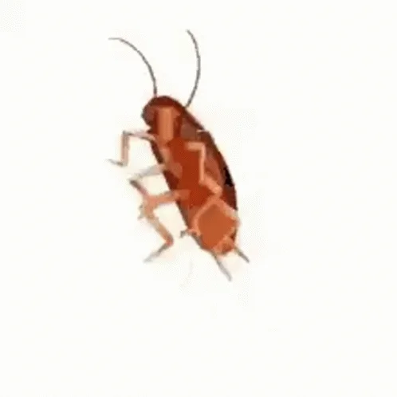
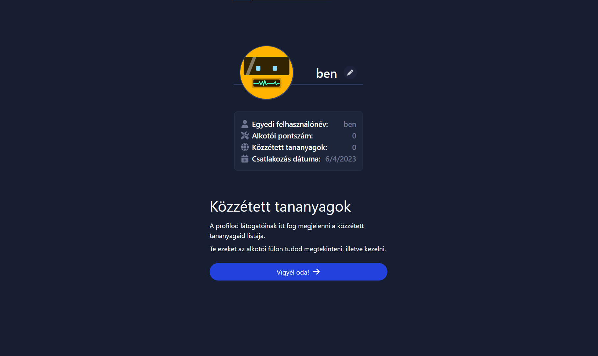
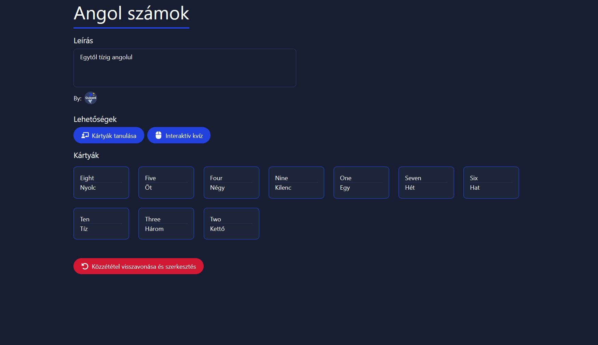
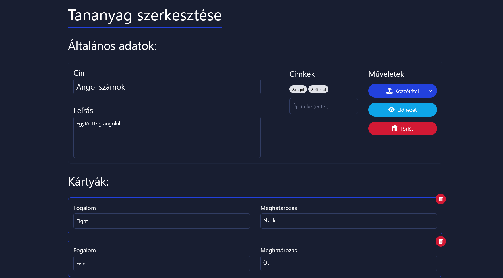
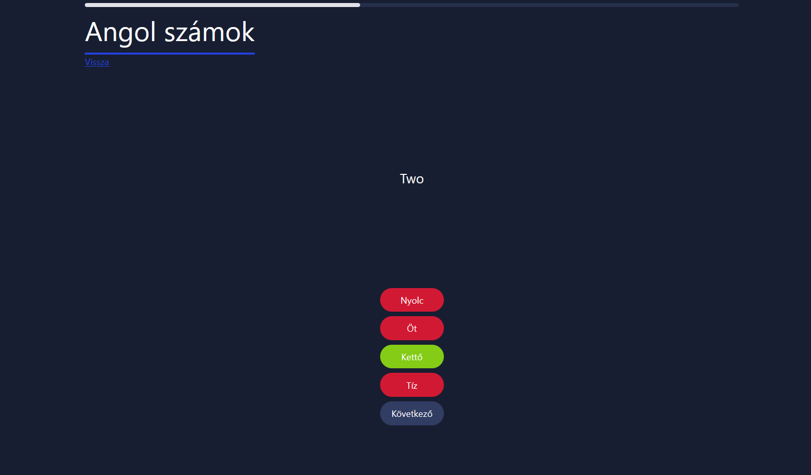
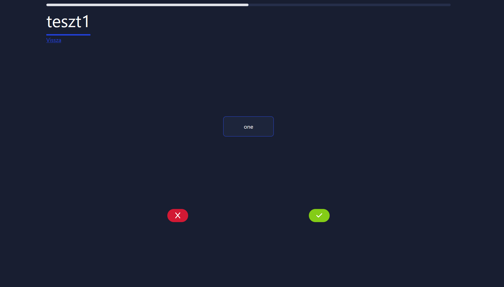

# <!-- Quizard -->

## <!-- new slide without title -->

## Funkciók

- Felhasználói fiókok
- Saját tananyag feltöltése
- Interaktív tanulás és ismétlés
- Tananyagok megosztása, keresése, felfedezése

## Célközönség

Bárki, akinek határidőre meg kell tanulnia valami konkrétat,
vagy csak szeret új dolgokat tanulni.

# Munkamegosztás

## Ádám

- A jobb felhasználó rendszer
- Adatbázis kidolgozása
- Általános design
- Tananyag szerkesztő
- Tananyag felfedező

## Beni

- Az eredeti, rosszabb felhasználó rendszer
- A kvíz algoritmus
- Tananyagok megtekintése, tanulása
- Prezentáció diasor

# Felhasznált eszközök

## A kód 🤓

- Nyelv: TypeScript 
- Web: SvelteKit 
- CSS: Tailwind 
- Adatbázis elérése: Prisma 

## Egyéb

- Adatbázis: Cockroach DB 
- Futtatás: Vercel 
- Kód megosztása: GitHub 

# Bővebben a funkciókról

##

##

##

##

##

# Fejlesztés közbeni problémák
##
<!-- ... -->

## Továbbfejlesztési ötletek

- Tananyag automatikus importálása (pl. quizlet)

# demo

## q&a

## Köszönjük a figyelmet :)
